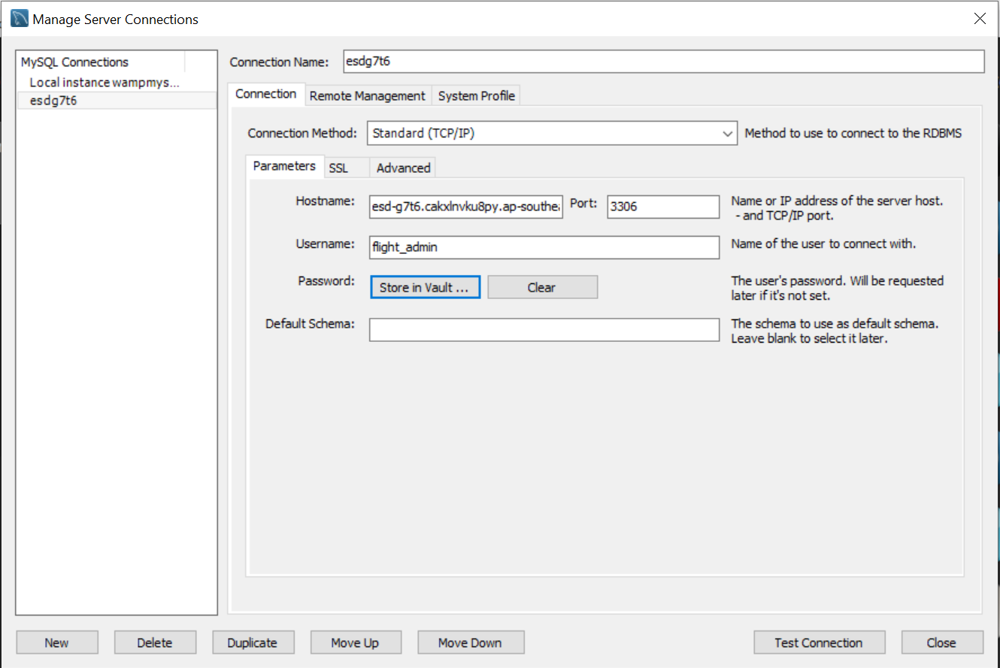
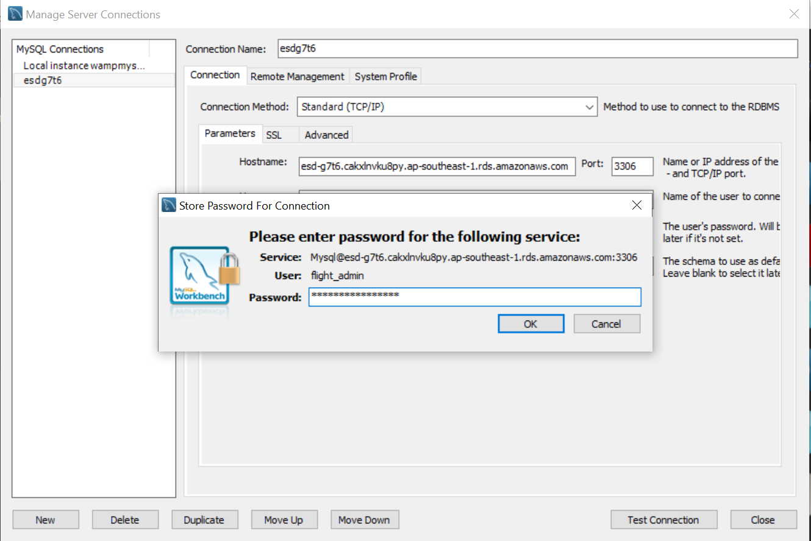
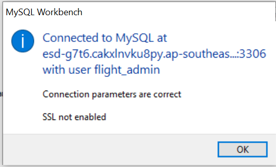

# Airline Enterprise Solution

Our airline enterprise solution provides flight services that can be accessed through a streamlined online booking system. The microservices under our enterprise solution are Pricing, Billing, Passengers, Flight, App, Booking and Notification.

## Prerequisites
We have built requirements.txt that includes the required Python libraries to be installed. In command prompt, navigate to flightapp directory and run the folowing command to install all dependencies in our enterprise solution.

```
pip3 install -r requirements.txt
```

Also, ensures that MySQL workbench in installed in the local computer.

## Access to database
The databases of microservices are set up with AWS Relational Database Service (RDS). In order to access the databases: 
1. Launch MySQL Workbench. Click on the Database tab, followed by Manage Connections.
2. Add a new connection. Key in the host name, username and your preferred connection name respectively.

    Host Name: esd-g7t6.cakxlnvku8py.ap-southeast-1.rds.amazonaws.com

	Username: flight_admin

	

3. Click on Store in vault and key in the password for the database. 

   Password: 6kKVm7C2PHtVtgGT

	

4. Click OK and test connection. The following message will appear if the database is successfully connected. 


	

The 4 database schemas are flight_booking, flight_name, flight passenger and flight_pricing. 

## Run the Microservices

The microservices will be run on local host. 

First of all, make sure you're at the correct directory 
```flightapp```


To run Flight, run this command in the command prompt windows:
```
python flight.py
```

To run Passenger, run this command in another command prompt windows:
```
python passenger.py
```

To run App, run this command in another command prompt windows:
```
python app.py
```

To run Booking, run this command in another command prompt windows:
```
python booking.py
```

To run Billing, run this command in another command prompt windows:
```
python billing.py
```

To run Notification, run this command in another command prompt windows:
```
python notification.py
```

To run Pricing, run this command in another command prompt windows:
```
python pricing.py
```
## Run the Microservices with Dockers
The 6 microservices, including App, Pricing, Flight, Passenger, Booking and Billing, are encapsulated in Docker containers. We have built and pushed the 6 docker images on Docker Hub at [here](https://hub.docker.com/r/vptv1310/flightapp). They can be pulled by using this command: 
```bash
docker pull vptv1310/flightapp
```

### Docker Compose
For ease of convenience, we have also leveraged on Docker Compose to deploy multiple microservices docker container at once with a single command.

We have built the docker-compose.yml file. In comand prompt, navigate to the flightapp directory and simply execute this command:

```bash
docker-compose up
```

## Access to Frontend UI
We make use of Jinja, a web template engine, to render the frontend web pages. 

For a complete user process to create and manage bookings, user begins by accessing the [Homepage](http://0.0.0.0:8000/about) where they can create an account or login to access the other services and webpages.

All our frontend webpages can also be accessed via these links:
* Homepage (About) : http://0.0.0.0:8000/about
* Create Account page: http://0.0.0.0:8000/create_account
* Login page: http://0.0.0.0:8000/login
* Offline check-in page for flight admins: http://0.0.0.0:8000/admin_search
* Cart page that shows the booking passenger chose: http://0.0.0.0:8000/cart
* Manage booking page to view bookings and check-in online: http://0.0.0.0:8000/manage
* Search flights page to select desired flights, dates and add-ons: http://0.0.0.0:8000/search_flights
* Logout: http://0.0.0.0:8000/logout

## Paypal Credentials

Sandbox credentials (for testing purposes)


* If you want to pay for a flight ticket, use customer credentials (@personal.example.com email suffix)
```
Email: sb-axjhj1232700@personal.example.com
Password: customer
```
```
Email: sb-l75ic1243151@personal.example.com
Password: customer
```

* If you want to see the balance of business's account, use business credential (@business.example.com email suffix)
```	
Email: sb-ln9xd1233508@business.example.com
Password: business
```


## Authors
* Bak Ing Sin @ingsin.bak.2017@sis.smu.edu.sg
* Bui Phuong Thao @ptvvo.2018@sis.smu.edu.sg
* Vo Pham Thao Vi @ptbui.2018@sis.smu.edu.sg  
* Loh Xiao Bing @xbloh.2018@sis.smu.edu.sg  
* Teo Jia Cheng @jcteo.2018@sis.smu.edu.sg

## Acknowlegement
* Professor: Alan Megargel
* Instructor: Ong Hong Seng
* Teaching Assistant: Chye Soon Hang 